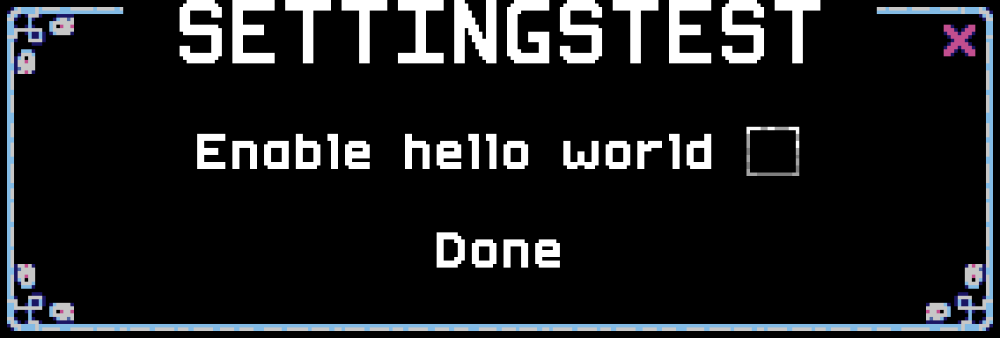
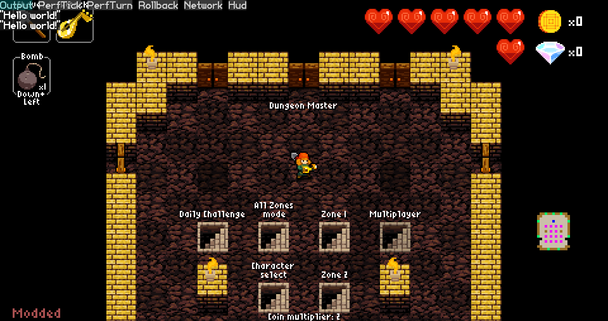
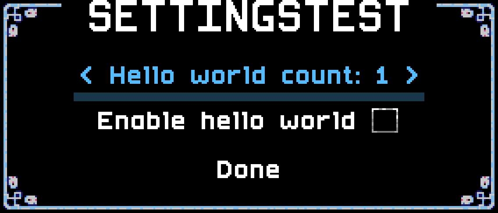
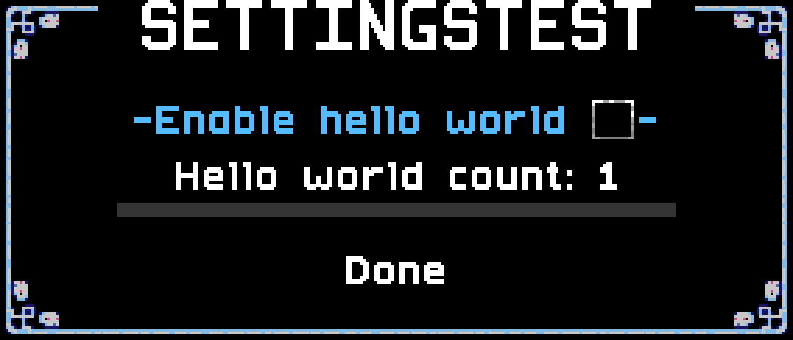
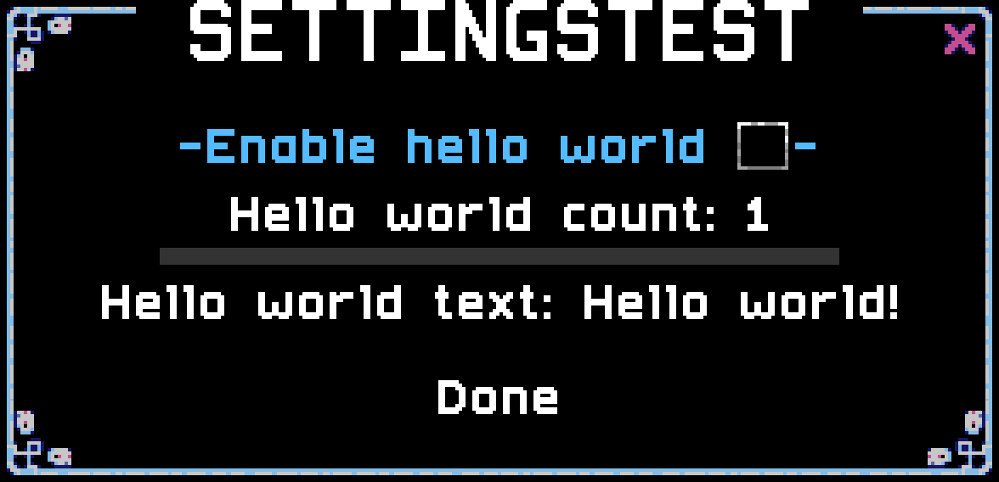
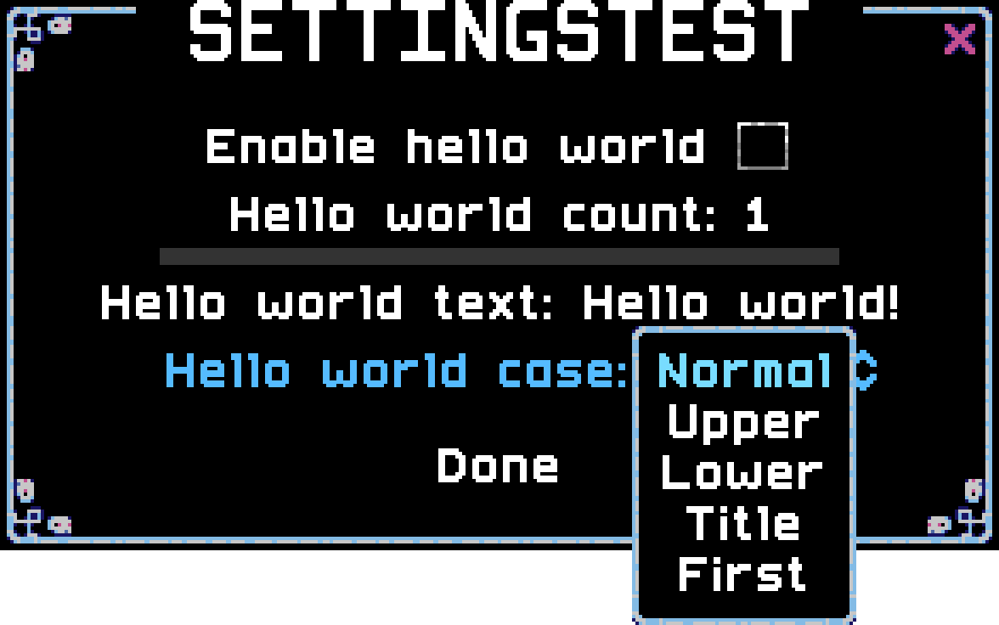
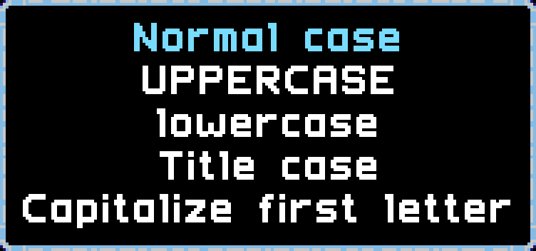

The Synchrony settings API can be used to offer players varying degrees of customizability in your mods by adding options accessible through **Options → Mod Options → (your mod name here)** or **Customize → Custom Rules → Mod Options → (your mod name here)**.

This walkthrough will introduce you to Synchrony's settings API. If you're already familiar with that, see [Conversion](Conversion.md) for a migration tutorial to PowerSettings!

To get started with using Settings, add the following to the top of your script (if it's not already present):

```lua
local Settings = require "necro.config.Settings"
```

<!-- *(You'll notice that I didn't use parentheses here. That's fine. `require "necro.config.Settings"` and `require("necro.config.Settings")` are identical calls.)* -->

⚠️ Code snippets in this walkthrough import modules with capitalized full names, the same as is written at the top of each page of Synchrony's own documentation, as that is also the author's preferred style. However, many modders will use lowercase module names with some shortcuts. You may use any name you'd like for importing modules (you can change the first "Settings" in the line above, for example `local cake = require "necro.config.Settings"`), but you must be consistent, including capitalization (so for example you'd write `cake.shared.bool` when the guide says `Settings.shared.bool`).

# Define a setting
The most basic setting you can define, the "Hello World" of the Synchrony settings API, is as follows:

```lua
HelloEnabled = Settings.shared.bool {
  id = "helloEnabled",
  name = "Enable hello world",
  default = false
}
```

*(Note that I didn't type `local` here, and I'm using `{}` instead of `()`; these are both important!)*

Once you've written that in your script, open the pause menu and go to **Customize → Custom rules → Mod options → (your mod's name)**.

You should then see the following:



*(My mod is named SettingsTest. You will see your own mod's name at the top of this menu.)*

And you should be able to toggle it by clicking it or pressing enter!

That all sounds great, but how do you get its value? Simply by using the variable you assigned it to, like any other variable. For example, try adding the following to your code:

```lua
Event.levelLoad.add("settingsTest", { order = "entities" }, function(ev)
  if HelloEnabled then
    print("Hello world!")
  end
end)
```

*(You don't need a require to use `Event` [or `event`]! If your IDE complains about an undefined global, you can ignore it or you can `local Event = require "necro.event.Event"` if you want to be explicit about it.)*

This code will run every time you load any level (including the lobby), and will print "Hello World!" to the debug output. That output can be viewed by pressing Shift+F1, or looking at `NecroDancer.log` within the same folder as the game itself.



# Setting types
Checkboxes aren't the only thing you can set! You can also create numeric sliders, text entries, or choice dropdowns. Let's make an example of each.

## Slider
Numeric settings are given sliders. Add the following to your code below the `HelloEnabled` block:

```lua
HelloCount = Settings.shared.number {
  id = "helloCount",
  name = "Hello world count",
  minimum = 1,
  maximum = 5,
  default = 1
}
```

Additionally, change the `levelLoad` event handler to:

```lua
Event.levelLoad.add("settingsTest", { order = "entities" }, function(ev)
  if HelloEnabled then
    for i = 1, HelloCount do
      print("Hello world!", i)
    end
  end
end)
```

*(I added the `i` to the print so you can distinguish between multiple in a single go.)*

Close and reopen the settings menu. It should now look like this:



Whoops! The new slider is above the checkbox! This will happen regardless of what order those entries are in within the script. By default, Synchrony will order your settings alphabetically based on their `id`, and `helloCount` comes before `helloEnabled`.

We want the checkbox first because it's a nicer presentation. To fix this, we'll need to add an `order` to each definition. Add `order = 0` to the `helloEnabled` setting, and `order = 1` to the `helloCount` setting (and don't forget the commas on the lines before those!).

Now it should look like this:



Play around with them if you'd like before moving on.

## Text entry
String settings are just simple text entry areas. Add the following to your code below the `HelloCount` block:

```lua
HelloText = Settings.shared.string {
  id = "helloText",
  name = "Hello world text",
  default = "Hello world!",
  order = 3
}
```

And rewrite the `levelLoad` handler again, as follows (you probably saw this coming):

```lua
Event.levelLoad.add("settingsTest", { order = "entities" }, function(ev)
  if HelloEnabled then
    for i = 1, HelloCount do
      print(HelloText, i)
    end
  end
end)
```

The menu should now look like this:



Again, feel free to play around with it a little bit.

## Dropdown menus
Dropdown menu settings, also known as "enum" settings, are a little bit more involved. You need to define the choices in an enum (an enumerated type) first. Before you can define enums, though, you need to require the `system.utils.Enum` module, so add the following to the top of your code:

```lua
local Enum = require "system.utils.Enum"
local StringUtilities = require "system.utils.StringUtilities"
```

*(StringUtilities isn't necessary for Enums but we'll be using it as well in a moment; might as well add it now.)*

Now define the enum by adding the following before the `HelloEnabled` setting.

```lua
local cases = Enum.sequence {
  NORMAL = 0,
  UPPER = 1,
  LOWER = 2,
  TITLE = 3,
  FIRST = 4
}
```

Have you noticed how I'm putting the code in discrete sections? The `require` statements are at the top, followed by the `Enum` definition, then the `Settings` definitions, and finishing up with the `Event` handler. It may be a good idea to mark these sections with comments at the top of each.

Now add the following to the bottom of the `Settings` section:

```lua
HelloCase = Settings.shared.enum {
  id = "helloCase",
  name = "Hello world case",
  enum = cases,
  default = cases.NORMAL,
  order = 4
}
```

*(I honestly didn't notice until now that I skipped `order = 2`. Did you? You'll notice that the code worked anyway — the order numbers don't necessarily need to be consecutive, and it won't create a gap or anything. But go ahead and fix it if it bugs you.)*

Lastly, change your `levelLoad` event handler to this:

```lua
Event.levelLoad.add("settingsTest", { order = "entities" }, function(ev)
  local text = HelloText

  if HelloCase == cases.UPPER then
    text = text:upper()
  elseif HelloCase == cases.LOWER then
    text = text:lower()
  elseif HelloCase == cases.TITLE then
    text = StringUtilities.titleCase(text)
  elseif HelloCase == cases.FIRST then
    text = StringUtilities.capitalizeFirst(text)
  end

  if HelloEnabled then
    for i = 1, HelloCount do
      print(text, i)
    end
  end
end)
```

Once you've done that and refreshed your settings menu, click on your new entry and it should look like this:



You can feel free to play around with them (tip: set the Hello World Text to "hello World!" to see the differences in all five cases!), but don't you find those words a little... bland?

Well, Synchrony offers a way to give your enum choices better names. Try changing your `Enum` definition as follows:

```lua
local cases = Enum.sequence {
  NORMAL = Enum.entry(0, { name = "Normal case" }),
  UPPER = Enum.entry(1, { name = "UPPERCASE" }),
  LOWER = Enum.entry(2, { name = "lowercase" }),
  TITLE = Enum.entry(3, { name = "Title case" }),
  FIRST = Enum.entry(4, { name = "Capitalize first letter" })
}
```

Once you reopen the settings menu, the case dropdown should now look like this:



*(Note that if you use all-caps, which is enabled by default, this menu won't override that.)*

# Setting settings
When defining settings, there are a good number of things you can put between the braces. They're documented more thoroughly on [VortexBuffer's site](https://vortexbuffer.com/synchrony/docs/modules/necro.config.Settings/#class-SettingsArgs), but a quick gist is:
* `id`: This should be a string with only alphanumeric characters and dots, and *must* be unique for all settings within a mod. The dots will come into play when we get into groups a little later. You shouldn't skip this. There are some circumstances in which you can skip this but it's generally bad practice to do so.
* `name`: This should be a string, naming the setting as shown to the user. You shouldn't skip this.
* `desc`: This can be a string or it can be omitted. If specified, it's a description shown to the user when they're hovering over the setting.
* `default`: You should use this to specify the default value of a setting.
* `order`: This is the order in which settings appear. Settings without an order appear after settings with one.
* `visibility`: Set to one of the values of the [`Settings.Visibility` enum](https://vortexbuffer.com/synchrony/docs/modules/necro.config.Settings/#enum-Visibility) to specify when it should be shown to the user. If omitted, it's treated as `VISIBLE`.
* `format`: A function that takes the value of the setting and returns a human-readable interpretation of that value. If you specify one, it's called every tick while the settings menu is open.

For enum (dropdown) settings:
* `enum`: The enumeration table that contains the entries to choose from.

For numeric (slider) settings:
* `minimum`: The lowest value to which the setting may be set.
* `maximum`: The highest value to which the setting may be set.
* `step`: The increment used when changing the setting's value with left/right keys.

For string (text entry) settings:
* `maxLength`: The highest number of characters you can fit in the string.

# Continuing
This is the end of part 1! The tutorial continues in [part 2](GettingStarted-2.md).

<!--
To get started with using PowerSettings, you'll first need to open your `mod.json`, find `"dependencies"`, and then add the following between the `{}`. (Note that if there's already something there, you'll need to separate this from that with a comma.)

```json
"PowerSettings_io_2237104": true
```

Now go to the top of the script you're writing and add the following code:

```lua
local PowerSettings = require "PowerSettings.PowerSettings"
```
-->